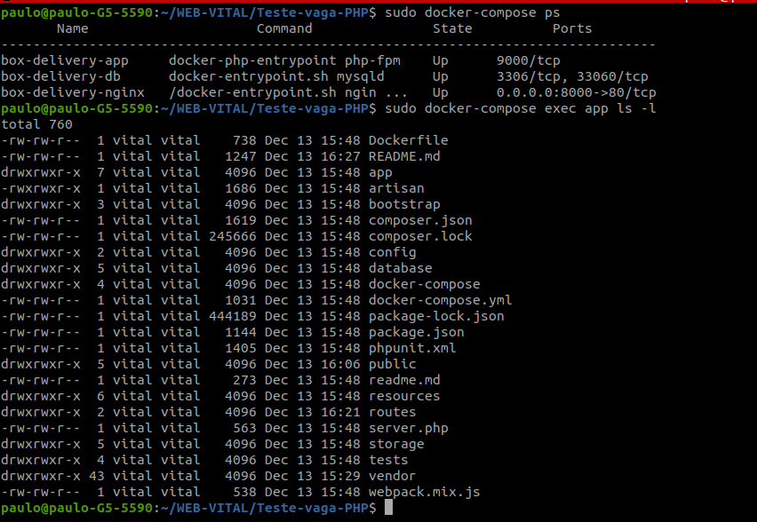
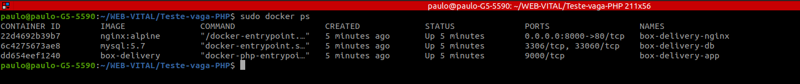
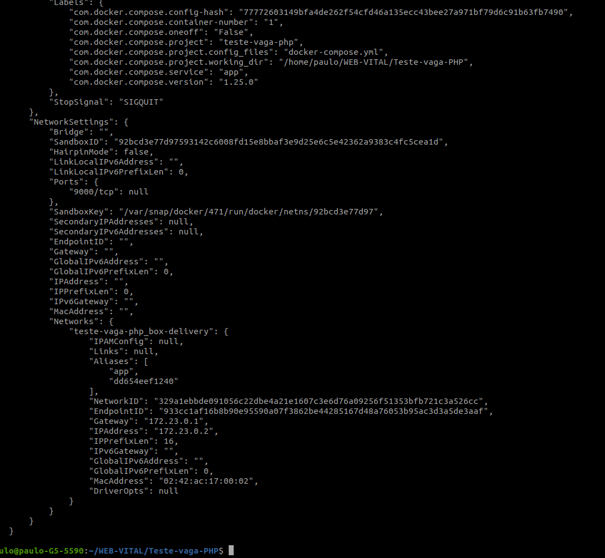
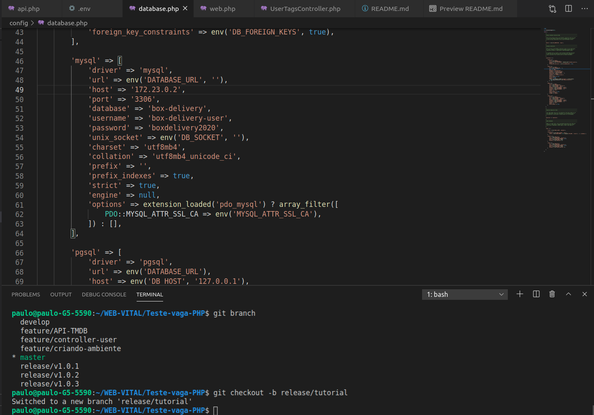
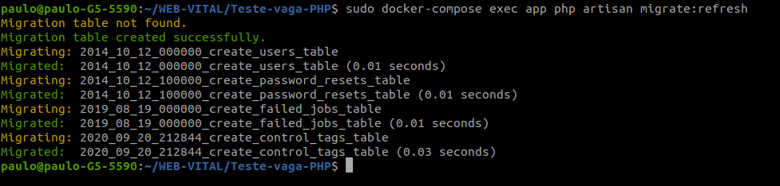
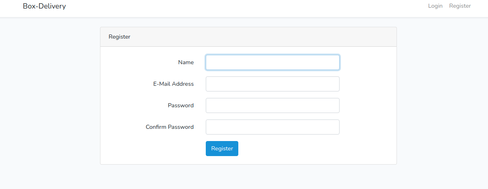
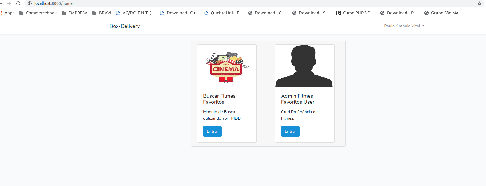
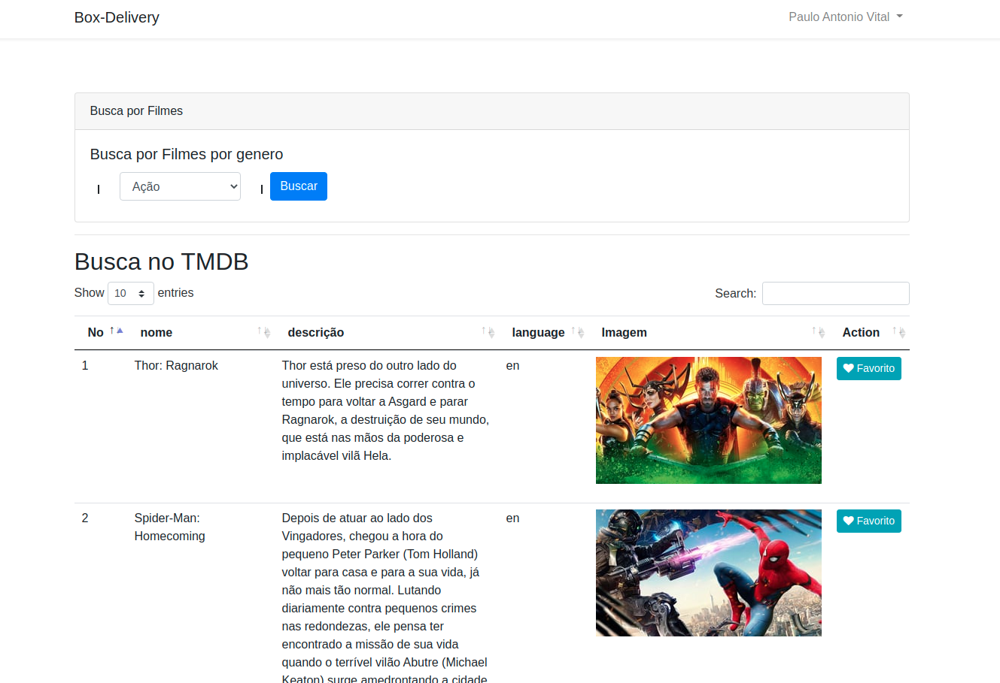
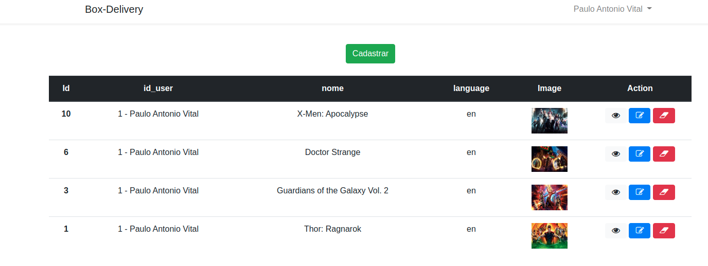

# Teste-Desenvolvimento-Box-Delivery

---
## Subindo o Docker para rodar o app
1. **sudo docker-compose build app**
2. **sudo docker-compose up -d**
3. 

---
## Instalar as dependências do composer
4. **sudo docker-compose exec app composer install**
---

## crie uma chave para o artisan
5. **sudo docker-compose exec app php artisan key:generate**

---

## Verifique o host do mysql que o Docker gerou

Comando no terminal:

6.0. **sudo docker ps**

6.1. **sudo docker inspect _id do mysql_**

6.3. Copie o numero do IPAddress 
* Ex:  _172.23.0.2database_
---

## Edit o host do mysql
7. **Abra o arquivo database.php linha 49 e coloque o host que o docker gerou**

---

8. Acesse o **_http://localhost:8000/_**

---

8.1 Crie as tabelas 

---

9. Crie seu usuario e realize o login 

---

10. Na home verá os seguintes módulos:

---
11. No Buscar Filmes encontrará a seguinte tela:

---

12. No CRUD User encontrará a seguinte tela com todas as funções (Inserir / Editar / Visualizar / Excluir):

---
